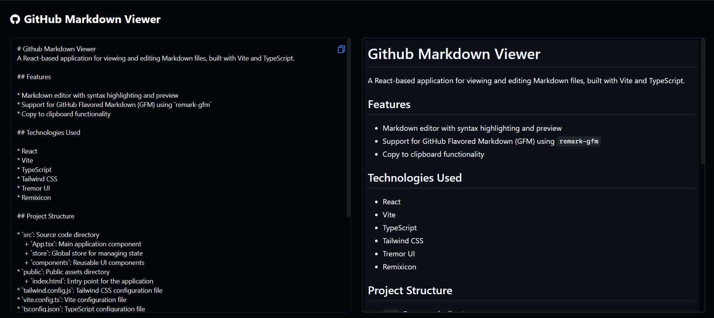

# Github Markdown Viewer

A React-based application for viewing and editing Markdown files, built with Vite and TypeScript.

## Features

* Markdown editor with preview with exact github styles.
* Support for GitHub Flavored Markdown (GFM) using `remark-gfm`.
* Copy to clipboard functionality.

## Technologies Used

* React
* Vite
* TypeScript
* Tailwind CSS
* Tremor UI
* Remixicon

## Project Structure

* `src`: Source code directory
	+ `App.tsx`: Main application component
	+ `store`: Global store for managing state
	+ `components`: Reusable UI components
* `public`: Public assets directory
	+ `index.html`: Entry point for the application
* `tailwind.config.js`: Tailwind CSS configuration file
* `vite.config.ts`: Vite configuration file
* `tsconfig.json`: TypeScript configuration file

## Installation and Usage

1. Clone the repository: `git clone https://github.com/your-username/github-markdown-viewer.git`
2. Install dependencies: `npm install` or `yarn install`
3. Start the development server: `npm run dev` or `yarn dev`
4. Open the application in your web browser: `http://localhost:3000`

## Contributing

Contributions are welcome! Please submit a pull request with a clear description of the changes made.

## License

This project is licensed under the MIT License. See `LICENSE` for details.